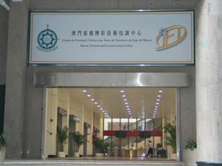
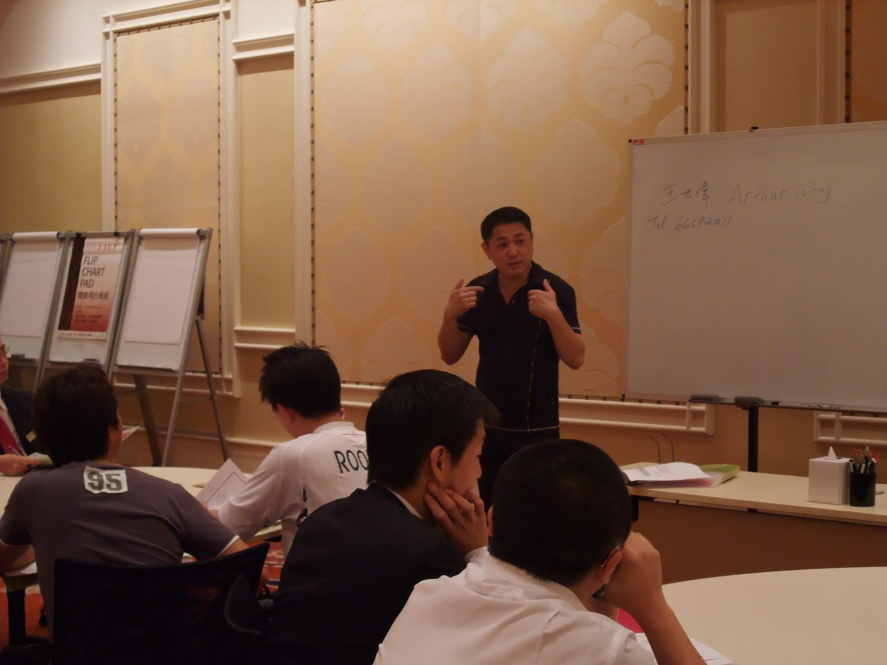
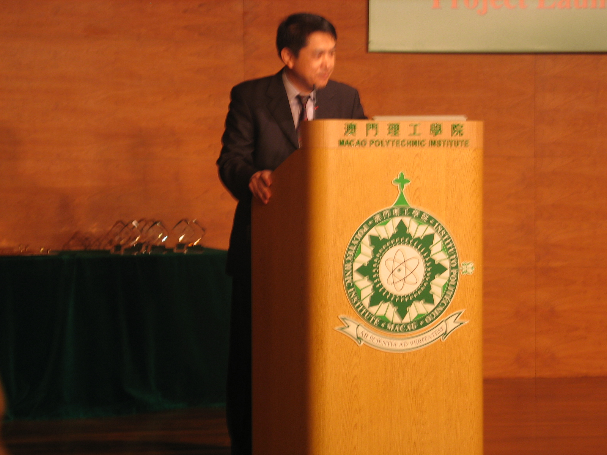
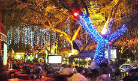
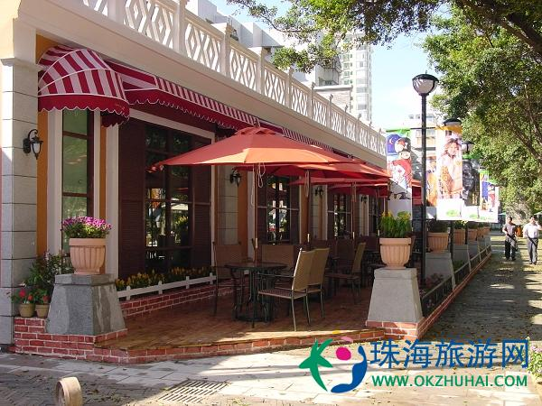

# 我的流水回忆录（1.7）回澳门工作

作者/王世伟

2003年，在和妈妈和妹妹联系中她们都认为现在澳门的形势很好，博彩业大发展有不少的大赌场要开，肯定会要人才，让我回澳门来看看是否能够施展一下我的才能。妹夫也有和人合伙开了一间专门让澳门警察来进修的法律学校。但是妻子在这一问题上和我有绝然不同的看法，她并不支持我再去发展新事业，认为我在家里照顾家庭就可以了，因为她教钢琴的收入已经足够一家的开支，但是我自己知道，我会在一天天寂静的无聊中迅速地老去。

3月我经过深思熟虑飞回了澳门，开始了我人生的又一次探险。回到了澳门，在妹妹的介绍下，马上去了刘老师开的“镜海学院”，刘院长让我马上为澳门的警察上“法律英语”课，警察们学了一个多月，多数都考试通过了广州暨南大学的英语口试。我的教学获得了一致的好评。警察学生们还特地请我吃了一顿葡国餐的“谢师宴”。但是，情况很快又有了新的周折，因为那时候中国大陆以及香港“非典”肆虐，广州暨南大学也被迫取消了下一轮的考试，我又处在失业的状态了。。。

在这期间我回了上海几次想做一点生意，因为我在上海有很多人脉。有很久没联系的大学的同学，联系上了才知道他们在上海都已经是大公司，大集团的老总。还有一位亿万富翁好朋友许先生，他是上海顶级小区（古北小区）的地产开发商。大家谈来谈去，谈得多做得少，也是因为当时市面不好，没能够谈出什么结果。此时我已经深深地了解到，我的回来大陆发展已经有点晚了，对上海的投资环境及人脉关系等都不甚了解。而且我本人的性格比较直爽，不喜奸滑，所以也不太能够成为一个生意人。

我决定还是回到澳门发展。这时新建的“金沙”酒店开始招聘了，我也去报了名，也参加了应聘。“金沙”赌场开门时人山人海，但是始终不见酒店部开张。妈妈和妹妹都认为我还是可以继续向教学方面发展。当时报纸上正好有理工学院和旅游学院的招聘，我便都投了履历。结果澳门理工学院先约我去面试。主任陈先生讲澳门理工学院要成立一个“博彩技术培训中心”。他看了我的履历让我教酒店管理，我问他用什么语言教，他讲用广东话，我认为自己不太行,因为自己的广东话还没有到可以在大学授课的水平。但使用英语教学是绝对没有问题的。主任认为学生可能英语水平太低，会听不懂。最后，他决定让我直接教英语课，我便成为了CCC的英语老师。这是上天对我的眷顾！我以前比较喜欢博彩，也有一定的经验，现在就当起了博彩的英语老师啦。

2003年的八月份中心开始招收了第一批学员，他们后来变成了澳门各大赌场的骨干力量。更有数位成了金沙赌场的高级“培训经理”。几年下来, 我所教的学生算算已经超过千位…很多时候在澳门甚至珠海任何场合都会遇见学生, 而他们都会很友善的和我打招呼或聊天。我越来越喜欢老师这个职业。我还被学校特定为主持博彩业的国际性会议，台下来自全世界的博彩业老板们济济一堂（英国，美国，澳洲以及欧洲的博彩业大亨们）。结果主持会议很成功！结束后，台下的一位英国教授握着我的手讲：“太成功了！你怎么一点不紧张？It’s so perfect! How come you don’t feel nervous?”我心想，你们来自世界各个地方，英语发音也完全不一样，我用是正宗的加拿大英语，正因为这样才使我主持时候谈笑风生毫不紧张。

在妈妈的大力支持下（经济上和思想上），同年夏天我也报考了广州暨南大学的“旅游管理”研究生，为期三年。上课时我常常感到，国内大学里所教的东西（酒店管理），我在西方国家里十几年前已经经历过的，很多教材已经过时了很久，而且师资也不够强大，上专业英语课的老师居然没有出国，仅去过新加坡这种英语很烂的国家。还有大学老师的工资实在是太低，和港澳地区相差太远了。原来暨大打算聘我去广州教课，但是由于薪酬相差太大，只好作罢。通过三年的“寒窗”苦读后，花了很多的精力，写出了论文“澳门博彩业服务营销策略探讨”。答辩当天，暨南大学请来了中山大学的陈老教授来主持，他以严格，严谨，严厉而出名。他仔仔细细的阅读后，并在好几处修改了我的论文，然后向我发起了十几个尖刻的问题，通过二个多小时的激烈辩论，因为毕竟我是对博彩还是有比较深切地了解。最后他们通过了我的论文答辩，我以全班最高分毕业，取得了梦寐以求的(旅游管理)硕士学位。这使我更加坚定地走上了教学之路。

我在澳门找回了一些20多年前的老朋友，如赵，汪先生，渐渐的也交了很多新朋友，如张，刘，曹，陆先生等等。。。我们平常有空时都会在张先生的店里喝茶聊天，谈艺术，人生和种种感兴趣的话题。晚上有空常常到珠海就餐，也去酒吧，舞厅消磨一下一周下来的疲乏的身心。人生的知心朋友是十分可贵的，大家聚在一起可以谈天说地，分享一下人生的苦与乐。

一个生命在不同的地方，会绽放出完全不同花朵，结出不同的果实！古人云：“橘生淮南则为橘，橘生淮北则为枳。”一个在加拿大要发神经病的人，在澳门这个充满异国热带风情的的小岛上，却是成了一位优秀的大学老师（屈指算来已教了上千名的学生），受到了社会的肯定和尊重。 

我还开始研究起了香港的股票，在这之前妈妈也买了不少的股票，但是亏损很大，我把妈妈的股票全盘接过来，慢慢在反复的实践中得到了很多的启发，同时常常在和朋友的聊天中，吸收他们的宝贵经验。自己制定了一套特别的方法定为“王氏理论”。渐渐的把妈妈的亏损赚了回来，并开始有了较大的利润。但我深知“鸡蛋不能放在一个篮子里”。我毫不犹豫的取出了利润部分，买下了第一套房产。我的目标是退休前能买多套单位。

由于长期分居两地和妻子在各种人生问题上有了很大的差异，尤其是对一些对家庭中重大事务看法的分歧，导致了我们两人中间慢慢地产生了很大的隔阂。主要是对于家庭未来的去向问题意见不一，我比较倾向于全家回澳门发展，因为中国更加开放了，更加发展了，从而变得更加强大，执政党的共产党也放弃了他们的一贯好斗作风，而开始注重于发展经济。我觉得我们在澳门或中国大陆会获得更高质量的生活和社会的尊严。但是她并不认同，她对于共产党的执政还是抱着过去的眼光。(可能这也不能怪她，那是由于她年幼时在中国所受的创伤太深的缘故)。她对我在澳门的发展和成绩也并不认同。而对很多的大家公认的问题也会提出相反的看法和意见。她认为加拿大的一切都可以忍受，而共产党的统治是绝对不可以忍受的，所以绝不会回澳门生活。但我认为在一个家庭里，男人作为父亲是一家之主,在重大的问题上应该要有主要的决策权。我绝对不认同上海“小男人”处处听命于妻子的这种奇异产物。2006年4月她回来澳门，我们在珠海度过了我们的20周年结婚纪念日，她回去后我们觉得我们的婚姻的确走到了头，结果我们协议还是分手比较明智。2008年我回到了加拿大，并办了离婚手续，一切钱财房产全部归她与两个儿子，我觉得钱财身外之物，没有什么大不了的，我有能力可以东山再起。一切从零开始吧！

离婚后，我觉得我自己基本上可以把握自己下半生的一切了。叶落终久要归根了，我有空一定要跑遍祖国的名山大川！

（草稿第一部完）

