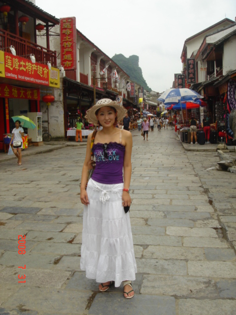

# 我的流水回忆录（2.1）林林与儿子

作者/王世伟

> 暂时略过2005-2008年

我的折腾人生这才正式开始啦！

人生常常会有峰回路转的机遇与缘分。2008年的夏天，在一次朋友聚会中我认识了一个在广州工作做平面模特的东北女孩，她毕业于东北鸡西市的师范学院艺术系，第一次见面我们就聊得很投缘，后来，我才知道我们相差了足足29岁！我53岁她才24！

林林大学时的艺术照  

在珠海一起唱歌

 
那时候她常从广州过来，而我则叫上了我的澳门朋友们一起大家出去玩，聊天吃饭唱歌跳舞等等，她的歌声十分之甜美，按照我的澳门老友老张来说：“那是要比邓丽君还要邓丽君”！的确她是经过5年西洋唱法的专业训练。曾经还得过黑龙江省青少年歌唱比赛的第三名。

随着时间的推移我们越来越来越有共同语言。八月底我们结伴去了美丽的桂林和漓江，一路上她对我的照顾可说是无微不至，大包小包她都要背在身上，我问她为什么要这样？她讲你年纪大了以前还受过伤，我不想因为出来旅游而让你再受到任何累和伤。（有时候从小事情就可以看出一个人的心）我也夺不过她，只能随她背去了。一路上其他游客都用奇异的眼光看我们，一个大老爷们居然让一个女孩子背着包。漓江的山水真正太漂亮了，我会讲一点广西话， 这样便认识了一对当地的竹筏艄公夫妇，一路上风景优美如画，我们的竹筏慢慢在漓江上漂流，我还脱衣下水去游了一程。每晚我们都去阳朔的酒吧小街闲逛，那里处处可见到老外，充满了异国的情调。爱情使我又焕发了无限的青春。

背着大包的林林

九月开学后，我比较忙了起来，便让她便搬来了珠海，我们暂时住在了好朋友汪先生的新买的房子里。我们常常一起写诗作画，还把我们的“杰作”贴在墙上，让好朋友们来参观。我从来没有好好练过毛笔字，所以看上去写得很不专业，也让朋友们见笑了。日子过得很舒心，这是一个新的小区，（华发新城）小区内景色宜人，有人工湖，湖里有金鱼还有几只天鹅，我们常常沿着小区的前山河跑步或溜达，晚上小区里除了男女老少在随着乐曲翩翩起舞还伴随着一片蛙声。不久她妈妈也从东北赶来看我们，对我这个毛脚女婿也表示了赞同，确定了我们的恋爱关系。

2009年春天五月， 我们一同乘火车到哈尔滨先到了她妹妹小玉家，她带了我们在哈尔滨的中央大街逛逛，那里的很多建筑都具有俄罗斯风味，我们欣赏了真正的东北二人转。但是哈尔滨这个城市让我留下唯一不好的印象是太脏太乱，可能是那里正在建造地下铁的关系吧？几天后我们到达她的家乡：虎林市，祖国最东北角上的一个民风非常纯朴的小城市，在那里我受到了她娘家亲戚好友们热情招待， 我也真正体会到了东北人的好客与豪爽。我还自己驾车去了边境的虎头要塞，放眼眺望就是乌苏里江和对岸的俄罗斯小镇。
 

在姥爷姥姥家的兴隆乡下，我见到了一片片的肥沃的黑土地，他们自己养鸡鸭牛马，生活得非常富裕，还有拖拉机，家家都有电话电视机。家家喜气洋洋。看来改革开放对改善农村生活来说是最好的见证。 

2009年9月26日，农历的八月初八，我们的爱情结晶在虎林市诞生了。一个十分可爱的男孩子。我们把他取名为王泽宇林。他一生下来便受到万千的宠爱，他是那么的帅气，真是人见人爱。但是3个月后，他身体出现了奇异的情况，常常呕吐和腹泻。结果姥姥姥爷把他送去了医院检查，虎林医院不行便转到鸡西市医院，鸡西医院还是不行又转到了哈尔滨儿童医院，医生们都束手无策，无法确症他的病。最后只能飞往上海，在上海机场好朋友老许车马上把他送到表哥道平联系好的上海儿科医院，经过上海专家医生的会症，得出结论这个孩子有先天的“蛋白质”过敏症。那就是意味着不能喝牛奶，和吃一切有蛋白质的食物。几星期后孩子和姥姥，妈妈一起回到了珠海我们新买的小家。澳门的奶奶和亲戚朋友们都来看了他，姑姑还买了不少衣服给他。不久姥姥姥爷带着他回到了东北。

2010年6月25日，东北传来了不幸的噩耗，由于一个亲戚的的疏忽大意喂他吃了些猪肝，使他又吐又泄，结果送去了虎林市人民医院，大夫们尽力地抢救了四小时后，孩子不幸离开了人世，去了永恒的天国。 悲哉！白发人送黑发人，我们心如刀绞，痛哭失声。。。

人生有起有落，这世界上真没有十全十美。。。

 
我泪如雨下写下了给孩子的唯一的信息：

 
宇林生病前胖嘟嘟的

王子病了，也瘦了

> 给我们亲爱的孩子：王泽宇林
> 你是天上的精灵
> 农历八月初八的日子
> 降临于我们温馨的小家
> 吴越之根的柔情孩子
> 体验着燕北大漠的阳光雨露
> 
> 精灵一旦降临人世
> 便集万千宠爱于一身
> 姥家，舅家，姨家。。。多少亲人
> 无私地献出塞北的亲情
> 你来到我们人间
> 给我们带来了无尽的欢声笑语
> 
> 亲爱的孩子
> 你聪慧的头脑                                                                         
> 明澈的双目
> 顽皮的笑脸
> 让我们为你感到荣耀
> 因为你是天上派来的精灵！
> 

> 从塞北  到江南
> 从广袤无边的黑土大平原
> 到繁华似锦的国际大都市
> 从祖国最东端姥姥的炕头
> 到南方边境爸妈的新家
> 到处都刻下了你的足迹
> 到处都留下了你的容貌
> 
> 你来到繁华喧嚣的人世
> 虽然只有九个月的时光
> 却让亲人为拥有你而自豪                                                            
> 因为你是天上的精灵！
> 你不能习惯人间的烟火
> 你便要来去匆匆
> 宛如长空中闪耀的流星
> 随着天际的白云
> 悠然而飘去。。。
> 与美丽的大自然化为一体！
> 
> 留下我们这些凡夫俗子
> 怎能理解你天上带来的使命？
> 你使凡间的亲人痛彻心肺
> 而你的灵魂却在天上
> 自由的飞翔着，俯瞰着大地
> 只有爸爸妈妈知道
> 你对我们的眷恋
> 你对我们的依依
> 在天上你会带给我们幸福
> 让我们更思念天上的你！
> 因为你是天上的精灵！
> 
> 亲爱的孩子，
> 我们知道你来这一趟不容易
> 你肯定是太累了
> 你轻轻地闭上了你的眼睛。。。
> 这是爸爸妈妈给你的唯一信息
> 让你知道我们人间的亲人们对你                                          你永远睡在天父的怀里                                 
> 无限的思念和恋恋。。。
> 你是我们永远的宝贝，
> 爸妈永远的甜蜜果
> 我们知道你在天庭看着我们。。。
> 
> 愿风儿轻轻的吹着你
> 愿阳光柔柔的伴着你
> 你在那浩瀚的宇宙中
> 尽情的飞翔吧！                                                          
> 爸爸 王世伟    妈妈 李秀林
> 2010年6月26日星期六

（其实后来想想我很自责，我们做父母的，还是有很大的责任，孩子就是不应该离开父母）

 

 

 

 