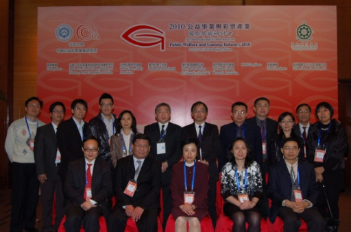
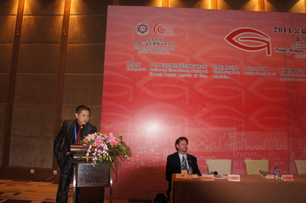
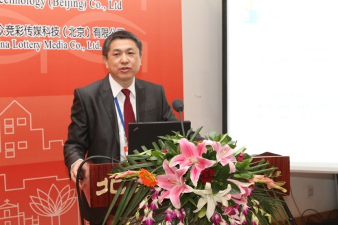
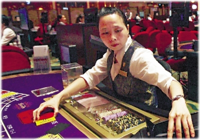
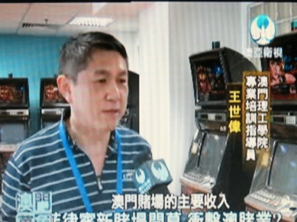
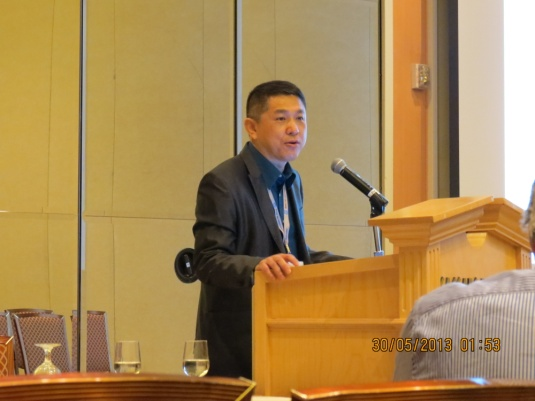

# 我的流水回忆录（2.2）小雅与事业

作者/王世伟

2012年 4月9日 星期一，我和林林一早进入澳门，到达镜湖医院，医生检查后，林林立即住院。

怀孕的林林

快要做妈妈了还是顽皮的

2012年4月10日星期二早上9点40分 ：我们可爱的女儿王泽雅在澳门镜湖医院出生，6斤4两 刨腹产，母女平安！可惜啊，妈妈和小姨都认为小雅生得丑，（没有小哥哥漂亮）还好有爸爸和姥姥的支持！（都说像爸爸，你是爸爸的前世情人啊！）

满月明星小雅 

 我要飞的小雅
 
 
美梦中的小雅   

冰山上的来客

自从女儿出生以后，我的事业便开始渐渐攀上高峰了！我应邀到了北京大学，美国拉斯维加斯国际博彩论坛，新加坡等地开始了一系列的演讲，电视台，以及报纸上也开始刊登我的文章。

从2008年开始，我每年在十月或者十一月参加在北京，由北京大学举办的国际博彩论坛，并从2010年开始，我成为了演讲嘉宾。

                                        
2008年11月在北京

2010年第七屆公益事業與彩票產業國際學術研討會  

2011年第八屆公益事業與彩票產業國際學術研討會（北京大学举办）

2012年11月14-17日，北京参加国际博彩会议， 住在北京国际会议中心，我发表了题为：Great Success of Las Vegas made by Thousands of Slot Machines, Brilliant Achievements of Macau made by High Stakes of Baccarat. 演讲。

2012年12月2日我的论文：-角子機與百家樂的角逐-拉斯維加斯與澳門博彩業的比較- 刊登在澳门日报经济版上面。全文如下：

當前報紙日：	2012 年12月2日　星期日 

> 角子機與百家樂的比較 

> 澳門理工學院博彩教學暨研究中心 王世偉

> 拉城與澳門的博彩業——  角子機與百家樂的比較

> 代表西方博彩聖地的拉斯維加斯和代表東方博彩聖地的澳門，卻有着截然不同的主要盈利方式。金錢從角子機裏“轉”進了拉斯維加斯；在澳門，金錢是在泥碼轉碼中“轉”進來的。

> 自從美國人查理斯菲發明第一架角子機之後，角子機便馬上在全世界蔓延開來。經過多年的不斷改良和提升，角子機漸漸吸引着全世界成千上萬的玩家，尤其是在美國本土。現代化的電腦技術則更是賦予角子機更新穎更廣闊的概念，並使其成為了美國、尤其拉斯維加斯主要的博彩方式。在一○年前，角子機是拉斯維加斯最流行的博彩方法，角子機的單項收入已經佔賭場收入七成。

> 百家樂收入波動大

> 當問到他們最喜歡的賭場遊戲是甚麼，百分之五十三準備去賭場的賓客說，他們喜歡電子遊戲機包括角子機和視頻撲克。廿一點遊戲佔據第二位在百分之廿三，撲克遊戲排在第三位有百分之七；西洋骰子和輪盤排在最後，各佔百分之三（根據美國博彩協會今年的賭場娛樂調查）。從以上的調查中我們可以得出這樣的結論：澳門最流行的百家樂遊戲在美國的博彩市場份額中，佔有率可能不到百分之三，基本上是榜上無名。

> 在美國，百家樂遊戲總是使人聯想起一種高貴典雅的感覺。一般來說，它只是大豪客和巨富用巨額現金來下注的遊戲。美國賭場的管理層深知百家樂遊戲的波幅不可控。他們之所以不會選擇波幅過大的遊戲，是因為這種遊戲很難預測，而且對每一個季度的收入都會有極大的影響。

> 反觀澳門博彩業，許多中國玩家堅信玩角子機就是一個被敲竹槓的過程，澳門賭場的角子機傳統上被認為是低賠出率、甚至是帶有極大欺詐性的。另外許多中國玩家被角子機深深地傷害過，所以他們把角子機叫做“老虎機”，就是因為老虎會張開大口吃下去，而不會吐出來。專家基本上都確證澳門的角子機賠出率在百分之八十五左右，但這僅僅是行業和監管機構之間的一種默契，在技術上並沒有強制執行，澳門賭場高層甚至可以不受限制地自由調整賠出率（筆者曾調查過賭場角子機的管理人員）。

> 百家樂遊戲是一種古老而簡單的撲克牌遊戲，它原來在澳門十分風行。百家樂之所以能在澳門本地快速流行，是因為它的賠率比較公正。你可以在澳門賭場的中場任何地方看到大批的百家樂賭檯，貴賓廳裏也完全被百家樂台佔據。玩家甚至可以用籌碼下最低的注碼，然後慢慢享受翻牌過程中的那種欣喜若狂的感覺。

> 百家樂能在澳門風靡流行，“賭團作業”也是主要元素。它起源於幾十年前，經過不斷的實踐，已被證實是一種非常成功的模式。這是一種獨一無二的吸引大豪客的方法，從而保證了博彩業能夠獲得持續的利潤。澳門的貴賓廳一般都租賃給私人企業，並由他們自己管理自己的全部財務運作和賬目。所以廳主非常依賴沓碼仔給他們帶來的穩定客源，以至於那些大豪客每時每刻都確保能受到帝王般的禮遇和享受。

> 中美博彩心態各異

> 在西方社會中，賭博是一種文化現象。美國的主流思想認為，賭博是一種休閒活動。美國玩家攜妻帶兒到拉斯維加斯旅遊，在賭場裏的花費常常是他們旅遊預算計劃的一小部分，輸贏對他們來說並不重要。他們追求的是娛樂，他們是用娛樂精神來看待賭博輸贏。

> 中國或亞洲的玩家到澳門賭博則是尋找刺激，而且他們情願承擔賭博帶來的巨大風險。“不是你（指賭場莊家）死就是我亡！”這是中國或亞洲玩家對待賭博的主流傾向。他們帶着一定數額的金錢到賭場“投資”，目的就是要贏錢帶回家去，所以他們追求的就是最終能否盈利。

> 在拉斯維加斯，賭場的訪客一般會設置不同的博彩預算，甚至接近一半的（百分之四十八）接受問卷者的賭場消費設定為不超過一百美元。百分之廿三的人會設定在一百到二百元之間。只有百分之九的人會設定在三百元以上。

> 對於內地到澳門賭場的玩家是否預先設定博彩預算呢？這方面目前還沒有能夠令人確信的資料。但是就筆者所知，如果一個賭客在賭場把他的全部賭金輸光後，很多時會通過有關的沓碼仔借貸，沓碼仔也會因為自己的利益樂於促成這種借貸的發生。

> 深化優勢彌補缺點

> 最後比較拉斯維加斯和澳門的兩個地區客戶服務的不同之處。拉斯維加斯大力強調要與所有的客戶建立起個人關係。他們會利用先進的技術，把每一個客人的資料存入“會員卡”，建檔分類處理。但是他們卻沒有意識到這樣會失去和客戶面對面交流的“私人互動因素”。澳門的不同之處在於當客人進入澳門賭場後，既可以享受帝王般的服務，又不必擔心他們的個人資訊被曝光。換言之，澳門強調的是人與人之間的、更為人性
> 美國拉斯維加斯和中國澳門博彩業的成功都有它們的一定理由。因此必須在這種自然形成的成功之上做得更好。換句話說，拉斯維加斯應該進一步發揚光大它的角子機業務，使之繼續以它獨特的娛樂元素吸引更多美國玩家，從而忽略它自身桌面遊戲的弱點，尤其是百家樂遊戲。另一方面，澳門必須繼續加強吸引有潛力的大富豪進入貴賓廳進行高額百家樂遊戲，來保證澳門博彩業的可持續繁榮。

> 同時結合兩地的優點，創造一種新的轉型產品，把他們合併在一起形成獨特嶄新的遊戲，這樣可以讓雙方都易於接受，然後推廣使之在兩地迅速流行。最後盡量吸取對方的優點以彌補自己的缺點。

> 澳門理工學院博彩教學暨研究中心 

> 王世偉

2012年12月23日我的论文：-扣除率：博彩業盈利之法寶- 刊登在澳门日报经济版上面。全文如下：

	
> 當前報紙日：	2012 年12月23日　星期日 

> http://www.macaodaily.com/html/2012-12/23/content_761855.htm

> 扣除率：博彩業盈利法寶 

> 澳門理工學院 博彩教學暨研究中心 王世偉

>  
> 扣除率是賭場的致勝優勢(路透社) 

> 扣除率：博彩業盈利法寶

> 澳門博彩業的優勢是甚麼？賭場是以何種方式穩賺利潤？專業荷官在牌戲進行中會否玩弄一些隱藏技巧？為甚麼絕大多數玩家都會輸錢？很多去過澳門賭場博彩最後鎩羽而歸的內地朋友常追問筆者類似上述問題。這主要是他們缺乏或根本沒有有關“賭場優勢”的知識。

> 全世界博彩業下屬的賭場，有着任何人也不能夠打破的鐵律：那就是“賭場優勢”。其實也就是每次玩家下注後的“平均損失率”，就是在賭場賠了贏家和殺了輸家後所保留給賭場的微小差額。這個差額永遠是正數。也就是說，賭場在每局遊戲後都肯定有錢賺。“賭場優勢”也可稱為“扣除率”。

> “扣除率”可以由如下公式表示：扣除率＝數學概率－（賭場賠給客人的）賠率。這是博彩業中通用的公式。雖然扣除率的高低範圍虛實明暗各有不同，但它絕對存在於任何地區任何賭場的每一項遊戲中。從每局遊戲的結果來看，扣除率似乎微不足道，但它卻是有保障、穩定和持續的，它每分每秒都在發生着。這才是博彩業盈利最根本原因。

> 統計資料顯示，澳門賭場的扣除率範圍約在1-33%之間。與美國或其他地區相比較，有些澳門賭場遊戲的“扣除率”相對還是較高。

> 高“扣除率”方式可取嗎？澳門博彩業與其他地區競爭的優勢是甚麼？本文將就以上問題對澳門賭場主要的博彩遊戲進行分析並探討。

> 百家樂扣除率最低

> 澳門博彩業96.5%的營業收入是由各種桌面遊戲帶來，百家樂則佔總收入86%以上。特別在私人貴賓室裡，幾乎100%都是玩百家樂。為甚麼百家樂會成為澳門最流行的桌面遊戲？因為賭客們發現，百家樂的賭場“扣除率”在澳門賭場所有博彩遊戲中是最低的。

> 賭客們認為扣除率越低，就越容易控制和保住自己的賭本。按賭場規則，他們可選擇下注在“莊家”或“閑家”，當“閑家”贏時，賭場不抽取任何佣金，100%賠出。當“莊家”贏時，賭場才會要抽取5%的佣金。長期的統計結果告之，“莊家”的勝算比“閑家”多出一點（“莊家”：“閑家”＝50.68%：49.32%）。同時，賭場會不停歇地每次在莊家贏錢時抽取佣金。看似微不足道，但是聚沙成塔，賭場才是永遠的最後贏家。

> 百家樂（包含和局）賭場的絕對贏率是：“莊家”：1.06%；“閑家”：1.24%；“和局”：14.36%。可以看到，賭場在“莊家”和“閑家”上僅有百分之一點多的絕對贏率；在“和局”上絕對贏率卻達14.36%。很多賭場還會不斷創立各種新的下注方式吸引賭客。如“至尊和局”、“莊對子”和“閑對子”等。綜合現時各種玩法的賠率，百家樂總體平均“扣除率”已提高到7%以上。

> 百家樂遊戲中的“限紅”制又是另一個保護賭場的規則。這個規則縮窄每場百家樂遊戲中賭場的風險。當全場一面倒下注於莊家或閑家時，賭場會設定一個最高下注限額。當賭客輸去一筆為數不小的金額後，很難在一局或兩局的搏殺中扳回損失。

> 骰寶扣除率高全球

> 骰寶遊戲俗稱大小遊戲。在澳門賭場投注100元投注骰寶中的“大”或“小”，賭客的購買價格是“扣除率”乘上投注額100元。由於骰寶規則規定開圍骰時“大”“小”通殺，開圍骰的概率為1/36，據此可推斷“大”或“小”的扣除率是2.78%（實際是1/36），故有關賭客實質要支付2.78元買這局的骰寶博戲（賭者開大或小），倘投注1,000元則付出為27.78元（用於圍骰時的風險）。實際上賭場應付與客人1,027.80元。在玩家贏錢時賭場僅付1,000元給客人，看似沒有抽水，實際上暗中已抽走27.80元。

> 在澳門的骰寶博戲中，“全圍”（即三個骰子出現相同數字）的賠率為1:24，但其數學概率為1:36。在美國同樣的“全圍”賠率為1:30。根據這個賠率，澳門的扣除率為30.56%；美國僅為13.89%。即賭客以100元投注“全圍”不論輸贏，按平均數計，要支付價格是30.56元。這也是全世界綜合性賭場所訂的“扣除率”中最高。從另一方面說，賭客在澳門下注“全圍”時要比在美國吃虧多了。

> 若將賭場賠率與數學概率比較，就不難發現骰寶中的大或小要比圍骰中的“全圍”或其他玩法的“扣除率”要低很多。其他骰寶博戲的各種選擇，其扣除率各有高低，在此不再一一詳述。

> 輪盤遊戲扣率2.7%

> 筆者曾研究過非洲和歐洲和中美洲一些國家的各種輪盤賭遊戲，它們與美國的輪盤賭有很大的區別。他們多數仍襲用歐洲式的，即36門另加一個zero“單零”共37個號碼，抽水即是1/37，賭場扣除率應為2.7%。

> 但筆者在九四至○三年間曾6次往返美國，注意到拉斯維加斯95%以上的賭場（尤其是新建者）都採用新式的美式輪盤。他們在其中36門外另加兩門zero，又稱“double zero（雙零）”。36個號碼另加兩個零就共38個號碼，這樣，它的抽水便為1/19或2/38，賭場扣除率為5.26%，比歐式傳統輪盤多抽水一倍左右。也就是說，美式輪盤賭遊戲中，賭場多賺一倍的錢。同樣，客人的贏錢機會也就減少50%。

> 所幸澳門賭場基本上仍沿襲傳統的歐洲式輪盤。其中也包括那些美資公司如：金沙，永利，威尼斯人等。但據筆者觀察輪盤遊戲在澳門也並不是太流行。

> 廿一點增額外注碼

> 21點牌戲在美國較流行，因它除了運氣外還需要賭客們有一定的技巧。當賭客贏了一手時，會得到100%賠率，且玩家贏時是不抽水的。對於精通玩技的玩家，賭場優勢為0.5%。但對於不太精通玩術的賭客，賭場的優勢就升到1.5%以上。

> 賭場還可增加許多額外的注碼選擇，這些都是對賭客不利的規則，從而可提高賭場優勢至0.8%以上。除此之外，還有很多相應的手法以提高扣除率，或對付那些專業賭徒及“數牌幫”等：例如：

> 一、收縮每次注碼的限紅，這樣賭客們就很難在短時間內通過幾手好牌迅速扳回來。

> 二、玩家利用數牌和記牌來改變賭場扣除率從而增加贏錢機率。當專業“數牌幫”知道牌靴裡還剩下很多大牌時，他們就會層層加碼，以獲得更大利潤。賭場對付他們的招數也是層出不窮：荷官卡牌時故意留下更多尾牌或多銷幾張面牌，這樣“數牌幫”或算牌的賭客就不能準確計算餘牌的走向。

> 三、當賭客們的運氣來臨時，賭場會頻頻替換荷官，或暫停遊戲而去進行一些其他的活動。賭場的這些微小動作，會令牌局的機率發生改變，一般玩家對此則很難有所察覺。

> 角子機賠出率偏低

> 在歐美人眼裡，角子機是一種遊戲而不僅是賭博，大多數人是採取輕鬆的態度來享受角子機遊戲。然而中國和亞洲賭客並不這樣認為，他們是來碰運氣、發橫財，對贏錢的期望很高。不同的心態就造拉斯維加斯和澳門角子機遊戲的地位：在拉斯維加斯，角子機收入佔賭場總收入七成；在澳門，僅有5%的收入來自於角子機。

> 以下是筆者對角子機的“持有率”和“賠出率”的研究。角子機的程式是預先設定的，以令賭場有一定比例的“持有率”和“賠出率”。所謂“持有率”就是保留在機器裡、作為賭場盈利的部分；“賠出率”則是賠給贏錢賭客們的比例。賭場的“賠出率”一般在70-98%不等。那麼餘下的2-30%就是賭場的持有率。所以賭場總是永遠的贏家。

> 以上可見，“賠出率”的大小至關重要。因此，美國賭場的角子機常有監管當局查檢，以證實他們的賠出率是否公正、合理，確保賭客們不會受欺詐。新加坡對角子機的賠出率也有強制性規定：即不得低於90%。

> 澳門博彩業專家一般認為角子機賠出率應設定在85%左右，但這只是行業和監管機構之間的一種默契，並沒有被強制執行。這也令澳門角子機營業額只在總體博彩營業額的5%以下徘徊。

> 據推斷，在其他因素不變下，若澳門博彩業適當地調整和減低某些過高的賭場“扣除率”，必定會刺激需求量的增加。若澳門博彩產品價格與國際接軌，並進一步拓展市場和擴大客源，那投注額增加是可以預期的。澳門的博彩業也得以繼續保持長盛不衰。

> 澳門理工學院

> 博彩教學暨研究中心

> 王世偉

2013年03月15日 接受澳亚卫视的采访

2013年03月24日我的论文：-周邊開賭 澳博彩業威脅與挑戰- 刊登在澳门日报经济版上面。全文如下：

http://www.macaodaily.com/html/2013-03/24/content_788568.htm	

> 	
> 當前報紙日期：	2013 年3月24日　星期日 

> 周邊開賭 澳博彩業威脅與挑戰 

> 澳門理工學院博彩教學暨研究中心 王世偉

> 周邊開賭  澳博彩業威脅與挑戰

> 昨天接受電視台採訪，記者提出兩個問題：第一個問題：“菲律賓斥資12億美元打造新賭場，十六日開門迎客。近年周邊國家和地區紛紛開賭場搶客源，對澳門博彩業影響有多大？”

> 從經濟學角度上來說，當一個行業特別賺錢，社會的資本一定會大量流入這行業從而攤薄它的利潤。這是一種正常社會經濟現象。澳門周邊地區紛開設新賭場，對澳門影響如何？衝擊力如何？是否具有威脅和挑戰？

> 本人認為影響肯定是有的，但從目前來看，它的影響還是微乎其微。

> 首先看澳門博彩業總體收入，在近十年裡，百分之七十左右的收入來自於貴賓廳。澳門貴賓廳的制度及其管理運作，全世界獨一無二。澳門博彩業貴賓廳制度經過三十多年的摸索階段，並不斷實踐和自我完善，形成今天佔澳門賭收百分之七十的牢固地位。澳門現今的大賭客都來自內地，他們和貴賓廳的沓碼有着牢固密切的關係。這些珍貴客源緊緊抓在沓碼手中，且沓碼還在不斷地開闢新客源。當然周邊地區的賭場可能會模仿，但這畢竟不是一朝一夕能仿效。

> 收緊政策繞道而行

> 當然澳門博彩業賭收還有百分之三十左右賭收來自於中場，這些散客，多數是由旅客及休閒客組成，他們有可能會到周邊地區的新賭場去體驗一下“新鮮”感。但他們總體目標並不是以博彩為主，財力也有一定限度。且由於交通問題、文化差異等，到訪周邊地區的次數也十分有限，暫不會對澳門博彩業構成特別重大的威脅。

> 但以下三種情況如果發生，即對澳門博彩業產生重大危機：

> 一、若內地有重大政策調整或改變，不利澳門博彩業（尤其貴賓廳業務的經營），例如中央進一步加大反腐倡廉力度，收緊內地各級官員甚至富豪們到訪澳門的政策，或進一步收緊自由行政策，那就會逼使這些客人繞過澳門，轉去其他地區博彩。

> 二、若周邊地區博彩業的各項法規比澳門現時的更完善，尤其是政策方面的優惠，例如碼佣優惠，回饋高端賭客的各種優惠等，也會吸引走一部分高端客客源。

> 三、若有重大社會動盪，不可避免的巨大自然災難、戰爭等。

> 周邊開賭攤薄利潤

> 第二個問題：澳門不斷有新建賭場落成開業，但博彩業收入增長率反減緩？

> 本人認為，○三年澳門博彩業剛打破壟斷，當時博彩業收入基數較低。賭權開放後，由原來的一家公司變為六家，並令澳門博彩業從地區級別走向世界級別，自然形成高速成長。今年已是第十個年頭，隨着它的基數越來越高，增長率自然緩慢下來，就像內地經濟發展指數一樣。以後這種情況會持續一段時間，然後形成一個平台，賭收指數將在此平台上下浮動，也很可能開始緩緩下降。因周邊同行業會漸漸攤薄澳門博彩業利潤率，但這大概需十年左右。

> 澳門政府及有關部門必須認真反思，如何應對來自周邊地區的挑戰，切實做好澳門博彩業進一步的規範與立法，以及加大加強博彩業有效的監管工作，以保證澳門博彩業在亞洲以及全球不可動搖的龍頭地位。

> 澳門理工學院博彩教學暨研究中心 王世偉

2013年五月25日启程去美国拉斯维加斯参加世界第十五届国际博彩大会

并于5月29日晨10点半
在凯撒皇宫酒店进行了演讲：

> 10:30 am - 12:00 pm Session 2-2-E Room TBA
> Gaming Management in Macau

> Moderator: Pieter Remmers, Assissa Consultancy, Europe
> Growth Trends in Macau’s Gaming Industry: a Scenario Analysis
> Zhonglu Zeng, Macau Polytechnic Institute

> Slots are to Las Vegas as Baccarat is to Macao: A Game Analysis

> Arthur Sai-Wai Wong, Macao Polytechnic Institute
  
这是我一生中事业的高峰！在美国的国际论坛上，面对全世界的学者用英语讲述澳门与美国博彩业的差异。后来获得美国拉斯维加斯大学的要求，把握的文章登陆在他们的网站上。。。。

2013我事业最为这是辉煌的一年！ 

