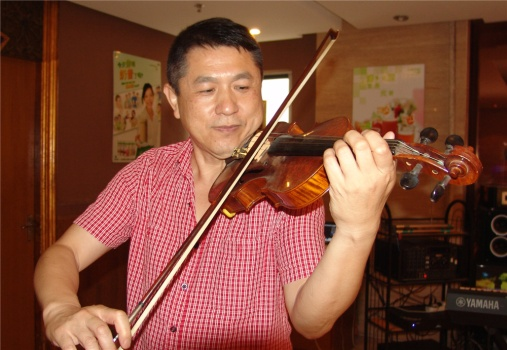

# 我的流水回忆录（2.3）生意与采访

作者/王世伟

2014年初一到初三带着小雅住在永利赌场与德全他们在赌场度过，非常开心。
   
在2013年的夏天，一个偶然的机会，加入了一个在珠海非常活跃的跳舞群。Salsa 舞蹈是起源于南美的一种舞蹈。我在5月从美国拉斯维加斯回来后在7月间便加入了。每周大约3-4次的练习，我基本上不缺席，报着锻炼身体的目的。

这是一个很好的舞蹈大家庭。因为入会收费比较昂贵，所以入了群力的人基本上都是档次比较高的。在此认识了不少的朋友。有律师，医生，老师，私营业者以及政府部门的人员等等。在珠海的圈子开阔了不少。
 
从夏天开始我也参加了不少的聚会；泳池派队，周年庆派队，摘水果一日游，旗袍派队，万圣节派队，圣诞节派队，新年派队，情人节派队，三八妇女节派队等等。

在这里有一位年轻的朋友王腾认识了以后和我进行了比较密切的接触。由于他的英文名字也叫Joshua， 我便认他为义子了。他与我交往的主要目的是想为一家在湖北十堰的外贸公司打开海外的市场。我在海外的人脉比较丰富，便介绍了美国，加拿大，日本以及非洲的各个朋友。

最后在2014年3月经过几度在上海以及香港的来回奔波和协商， 我们的公司终于成立了名为“东方嘉驹”与在尼日利亚的“西非尼日利亚金门”和在了一起。这里要提一下我的非洲尼日利亚好友胡介国先生。我们在1986-1990年在尼日利亚共事，是一位非常睿智的企业家。曾任尼日利亚总统的顾问，并在尼日利亚促进了不少中国企业的发展。王腾去了非洲。。。

2014年3月23日星期日，于上海成都南路公主照相馆，靠近淮海中路

2014年4月25日到5月9日，先去了哈尔滨，与小雅，林林，爸爸妈妈一起会合了。然后我们去了大庆，见了大玉和小房子，在大庆参观了林甸的温泉，接着去了长春，住了一晚后，上了长白山一日游，后又回到了大庆，返回哈尔滨。一路玩得很开心，小雅很健康。也拍了不少照片。

2014年6月15-21日带领理工大学生去新加坡参观实习，59岁生日在新加坡度过。

澳亚卫视2014年6月24-28日对我进行了采访 

关于澳门博彩业老虎机的报道

- http://www.imastv.com/program/article.php?id=4884
- http://www.imastv.com/program/article.php?id=4894
- http://www.mastv.cc/program/article.php?id=4901
- http://www.mastv.cc/news/article.php?lang=cht&id=42656

> 《賭城中的暗黑王國001》：澳門角子機現狀
> 更新日期： 2014/06/25 12:00:39  　澳亞衛視 ／ 綜合報導 
> 自2002年賭權開放以來，澳門的角子機的數量急增超過四倍，而且為了吸引更多的賭客，角子機的玩法花樣也在不斷轉變.

> 角子機也叫老虎機、搖彩機或者彈子機。2002年賭權開放之前，澳門角子機的數量只有900多台。賭權開放后的這些年，角子機的數量急劇增長，2005年年底已經有3421台，到2007年已經增長到13267台，頂峰期是2012年的16585台，目前截至到2014年第一季度，角子機的數量是13232。

> 澳門理工學院博彩教學暨研究中心專業培訓指導員 王世偉接受本台記者採訪時，說到，從文化角度來說，中國人已經定義這個東西（角子機）是老虎機，老虎是要吃人的；從過往的經驗來說，澳門老虎機的賠出率不是很高，而且沒有標明賠率是多少。但美國的老虎機賠率是95.25，連小數點後面兩位都清清楚楚地標明。

> 老虎機投注門檻低 發展空間大
> 王世偉指出，由於人工賭檯的最低投注額提高，每注投注額都要一兩百以上，有些玩家覺得投注高，他們就會轉向玩老虎機。

> 電子賭檯省人工效率高 商家充滿期待
> 王世偉還說，電子賭檯它的收益非常快，一般來說，一個賭檯用人手做的話，一個遊戲有很多人玩，它起碼要5分鐘、10分鐘才能賠償完，但是電子化了之後，速度就非常快，見輸贏后，1分鐘馬上賠付。

> 伴隨著角子機數量的增長，角子機的毛收入也大幅增長。2002年，角子機的毛收入只有2億多澳門元，而截至到2014年第一季度，角子機的毛收入為39.43億澳門元。

> 角子機在澳門賭場盛行，但賠付信譽卻不好，屢屢傳出玩家中大獎，博彩公司拒絕派彩的消息。

> 澳門理工學院博彩教學暨研究中心教授 曾忠祿認為，賭客贏了大錢后，博彩公司找各種理由拒絕賠付的行為，是有欺詐之嫌的，是不合理的。

> 同時曾忠祿也指出，澳門的博彩監管法律規定機械故障可以作為不賠償理由，該規定本身就存在問題，不盡合理。

> 據澳門博彩監察局數據就顯示，2012年至今，因角子機故障而引起的賠償個案有133宗，而其中只有3宗經過博彩監管當局的協調而解決。

http://cc.imastv.com/news/article.php?lang=cht&id=42719

> 《賭城中的暗黑王國002》:角子機賠率可調 

> 更新日期： 2014/06/26 11:50:24  　澳亞衛視 ／ 綜合報導 

> 近年，角子機出現了巨大的變化。首先就是從形體上，變得越來越大，甚至角子機這個名字用在這些龐大的器具上都有些不合適。但是他的發展迅速，收入增長也是驚人，三年間就翻了近10倍。

> 今年1月份，澳門經濟財政司司長 譚伯源曾說過，現在的角子機已經與過往我們一般所說的老虎機等等概念已經有很大的分別，電子化的一些博彩儀器博彩器具發展的都很快。

> 新型的電子博彩設備已經成了賭場收入的增長點。

> 澳門理工學院博彩教學暨研究中心教授 曾忠祿：“它（電子博彩）游戲的變化畢竟比賭桌的要多很多，我覺得未來還是有發展的前途。”

> 根據澳門博彩監察協調局統計顯示，澳門直播混合游戲收入已經從2010年的1.53億增長到2013年的14.87億，三年間增長接近10倍，遠遠高出博彩毛收入三年間的1.9倍增幅。

> 澳門理工學院博彩教學暨研究中心教授 曾忠祿：“以前一個荷官只能管幾個人或者十幾個人，但是一台真人電子賭桌的話帶動幾十台類似於老虎機的機器。”

> 澳門從2010年開始限制賭台的增長，但對於電子博彩設備的監管，直到今年年初，澳門政府才表示會考慮對其的管理政策。

> 對此，澳門理工學院博彩教學暨研究中心講師 劉爽表示，單純對角子機數量進行限制不一定能夠完全達到保護居民的設想。如果澳門社會認為保護居民是非常重要的話，那我們可以倡議讓角子機推行會員制。

> 近幾年，美國內華達州角子機的數量逐年下降，但單機單日的收入卻逐年增加。多位博彩專家都表示，僅僅設置數量限制只能讓商家找到把設備做大等方式去規避措施。

> 角子機賠率知多少

> 澳門理工學院博彩教學暨研究中心專業培訓指導員 王世偉告訴記者，老虎機一出場就可以設定賠率，賠率的多少是可以調的。

> 美國各大賭場都會公開自己的賠出率來吸引賭客。根據統計資料，北拉斯韋加斯的賠出率最高達到96.5%。

> 而澳門各大賭場在年度財務報表中披露的賠出率是94%左右，但是最新一期的博彩雜志上，多位專家披露澳門角子機的賠出率只有85%左右。

> 澳門理工學院博彩教學暨研究中心專業培訓指導員 王世偉：“我問過很多老虎機的經理、從業人員，他們說，澳門一般的賠出率在70%到80%左右。”

> 王世偉認為政府雖然已經加強了對賠出率的監管，但是還不足夠。同時也有負責任博彩團體的代表指出，政府在過去一段時間對角子機的關注不多。

http://www.imastv.com/news/article.php?id=42745

> 2014/06/25 10:47:46  澳亚网 ／ 澳门报导

> 在赌场，有一种博彩形式叫做角子机，也就是俗称的“老虎机“，操作简单，容易上手。七年来澳门角子机的数量就暴增超过四倍，而为了吸引更多赌客，角子机的花样也是不断翻新，但不变的是它总是赢的一方！

> 霓虹灯闪烁赌场人流如织，这是人们对夜色中澳门一般的认识。二十一点、百家乐、德州扑克，各种博彩玩法应有尽有，但是在角落里还有一个种玩法也不能小视，他就是角子机，也叫老虎机、摇彩机或者弹子机。

> 2002年赌权开放之前澳门角子机的数量只有900多台，随着赌权开放，角子机的数量也是急剧增长，2005年年底已经有3421台，到2007年已经增长到13267台，数量最多的是到2012年，已经达到16585台。

> 澳门理工学院博彩教学暨研究中心专业培训指导员王世伟表示，文化角度来说，中国人已经定义这个东西是老虎机，老虎是要吃人的，因为从过往的经验来说澳门老虎机的赔出率不是很高，不像美国他们说的清清楚楚，他们老虎机的赔率是95.25小数点后边两位数都显示出来。

> 王世伟指出，在澳门角子机扮演的角色还是配角，主要的玩家对象有两类。

> 王世伟：“一部分我们讲当地人会进去玩一下，不过当地中国人应该说不是很多，据我所知很多是外劳，菲律宾人在社区附近进入的门槛比较低，不用花太多钱在赌场正式的赌场里边一般都是年青人或者是情侣呀休闲客玩一下，这是属于一种娱乐的形式。”

> 未来角子机的发展空间很大
> 王世伟：“人工赌台的最低投注额已经开始提高了，很多人觉得我玩这个有一点吃力了，我们讲的中场中端、低端客人他们会转向到玩一下老虎机。”他指出角子机正在向电子赌台转变，让商家对角子机充满期待。

> 角子机的毛收入从2002年的2亿多澳门元已经增加到39.4亿澳门元，在博彩收入中的占比接近5%，现在的角子机的花样是越来越复杂，背后潜藏的秘密也是越来越多。

> 很多赌客, 选择赌注相对比较小的角子机来玩，可是,当你真的中了头奖却不一定能拿到钱，之前就发生好几次赌场以机器故障为理由，拒绝支付奖金，让赌客非常不满。

> 澳门博彩监察局数据显示，2012年至今133宗角子机故障而引起的赔偿个案，当中只有3宗经过博彩监管当局的协调而解决。

http://www.mastv.cc/news/article.php?id=42644

> 澳门赌场角子机 7年激增逾四倍 
> 更新日期： 2014/06/25 10:47:46  　澳亚网 ／ 澳门报导 
> 在赌场，有一种博彩形式叫做角子机，也就是俗称的“老虎机“，操作简单，容易上手。七年来澳门角子机的数量就暴增超过四倍，而为了吸引更多赌客，角子机的花样也是不断翻新，但不变的是它总是赢的一方！

> 霓虹灯闪烁赌场人流如织，这是人们对夜色中澳门一般的认识。二十一点、百家乐、德州扑克，各种博彩玩法应有尽有，但是在角落里还有一个种玩法也不能小视，他就是角子机，也叫老虎机、摇彩机或者弹子机。

> 2002年赌权开放之前澳门角子机的数量只有900多台，随着赌权开放，角子机的数量也是急剧增长，2005年年底已经有3421台，到2007年已经增长到13267台，数量最多的是到2012年，已经达到16585台。

> 澳门理工学院博彩教学暨研究中心专业培训指导员王世伟表示，文化角度来说，中国人已经定义这个东西是老虎机，老虎是要吃人的，因为从过往的经验来说澳门老虎机的赔出率不是很高，不像美国他们说的清清楚楚，他们老虎机的赔率是95.25小数点后边两位数都显示出来。

> 王世伟指出，在澳门角子机扮演的角色还是配角，主要的玩家对象有两类。

> 王世伟：“一部分我们讲当地人会进去玩一下，不过当地中国人应该说不是很多，据我所知很多是外劳，菲律宾人在社区附近进入的门槛比较低，不用花太多钱在赌场正式的赌场里边一般都是年青人或者是情侣呀休闲客玩一下，这是属于一种娱乐的形式。”

> 未来角子机的发展空间很大
> 王世伟：“人工赌台的最低投注额已经开始提高了，很多人觉得我玩这个有一点吃力了，我们讲的中场中端、低端客人他们会转向到玩一下老虎机。”他指出角子机正在向电子赌台转变，让商家对角子机充满期待。

> 角子机的毛收入从2002年的2亿多澳门元已经增加到39.4亿澳门元，在博彩收入中的占比接近5%，现在的角子机的花样是越来越复杂，背后潜藏的秘密也是越来越多。

> 很多赌客, 选择赌注相对比较小的角子机来玩，可是,当你真的中了头奖却不一定能拿到钱，之前就发生好几次赌场以机器故障为理由，拒绝支付奖金，让赌客非常不满。

> 澳门博彩监察局数据显示，2012年至今133宗角子机故障而引起的赔偿个案，当中只有3宗经过博彩监管当局的协调而解决。

2014/06/25 18:59:46  　澳亚卫视 ／ 综合报导

> 角子机也叫老虎机、摇彩机或者弹子机。从文化角度来说，中国人已经定义这个东西（角子机）是老虎机，老虎是要吃人的。

> 老虎机投注门槛低，玩家入场容易。
> 澳门理工学院博彩教学暨研究中心专业培训指导员 王世伟接受本台记者采访时，说到，由于人工赌台的最低投注额提高，有些玩家觉得投注高，他们就会转向玩老虎机。目前，澳门人工赌台上，每注的最低投注额可能需要百元，而角子机的投注额却可以低至每注几分钱。电子赌台省人工效率高，商家充满期待。王世伟还说，电子赌台它的收益非常快，一般来说，一个赌台用人工做的话，一个游戏有很多人玩，它起码要5分钟、10分钟才能完成赔付，但是电子化了之后，速度就非常快，见输赢后，1分钟马上赔付完成。Natasha Schüll是美国麻省理工大学的一名文化文类学家，同时还是一名老虎机专家，在其著作里的《全球博彩业东征：澳门的老虎机行销》写道，“远东地区有40亿人口，而老虎机却不足3万台，所以该地区被国际机器博彩业视为必争之地。”

> 6月24日起，澳亚卫视推出《赌城中的暗黑王国》系列报道，揭密澳门老虎机不可告人的背后黑幕。敬请锁定澳亚卫视19点03分播出的《澳门万象》、20点播出的《澳亚新闻》及22点30分播出的《网罗新观点》！

2014/06/26 18:24:47  　澳亚卫视 ／ 综合报导

> 角子机的赔率是可调的，您知道吗？

> 澳门理工学院博彩教学暨研究中心专业培训指导员 王世伟告诉记者，老虎机一出场就可以设定赔率，赔率的多少是可以调的。

> 美国各大赌场都会公开自己的赔出率来吸引赌客。根据统计资料，北拉斯韦加斯的赔出率最高达到96.5%。

> 而澳门各大赌场在年度财务报表中披露的赔出率是94%左右，但是最新一期的博彩杂志上，多位专家披露澳门角子机的赔出率只有85%左右。

> 澳门理工学院博彩教学暨研究中心专业培训指导员 王世伟：“我问过很多老虎机的经理、从业人员，他们说，澳门一般的赔出率在70%到80%左右。”

> 王世伟认为政府虽然已经加强了对赔出率的监管，但是还不足够。同时也有负责任博彩团体的代表指出，政府在过去一段时间对角子机的关注不多。

> 澳门负责任博彩协会理事长 宋伟杰：“（政府）对于赌台的控制是的确有的，例如年增长不超过3%，这个有做；但是到角子机，因为赌场主要收入不在这方面，可能会比较忽略了。”

> 宋伟杰也指出，（政府的监管）当然可以透明度高一些，但是从监管的角度来说，太透明化的话，在监管方面也是有些不方便。如果很多东西让外界知道怎么监管的话，就会被人钻漏洞或者是空子。但是如果完全不透明，市民就会有所质疑。他建议，政府可以适量的将监管透明化一些。

> 6月24日起，澳亚卫视推出《赌城中的暗黑王国》系列报道，揭密澳门老虎机不可告人的背后黑幕。敬请锁定澳亚卫视19点03分播出的《澳门万象》、20点播出的《澳亚新闻》。
> 《赌城中的暗黑王国003》：电子博彩发展快 应加强监管

> 2014/06/27 18:14:11  　澳亚卫视 ／ 综合报导

《赌城中的暗黑王国》系列报道：电子博彩 未来“兵家”必争之地

> 澳门从2010年开始限制赌台的增长，但对电子博彩设备却不设限制。

> 今年1月份，澳门经济财政司司长 谭伯源曾说过，现在的角子机已经与过往我们一般所说的老虎机等等概念已经有很大的分别，电子化的一些博彩仪器博彩器具发展的都很快。

> 新型电子博彩设备 发展前景好

> 澳门亚洲国际博彩博览会 参展商：“未来澳门即将有6间大型赌场开设，在角子机方面的发展应该不是主要的问题。公司现在最核心的市场是要推广电子赌台。”

> 澳门理工学院博彩教学暨研究中心专业培训指导员 王世伟：“商家因为赌桌数量限制，不能再增加赌桌了，誓必要增加老虎机和电子机，就看怎么宣传把中高端的客人引向电子赌桌方面。虽然目前收益还不是很大，但远景来说是非常好。”

> 澳门理工学院博彩教学暨研究中心教授 曾忠禄：“它（电子博彩）游戏的变化毕竟比赌桌的要多很多，我觉得未来还是有发展的前途。”

> 澳门理工学院博彩教学暨研究中心讲师 刘爽：“真人电子游戏，一方面是有真人在一张赌桌上派牌，另外一方面就是从客户角度来讲，与传统真人赌台不同在于他可以带很多有角子机性质的终端机，赌客就可以在终端上进行操作，它的特性就是兼具了真人赌台和角子机两方面的特性。”

> 目前国际上，对于混合直播游戏定义还不明确是否属于角子机，但真人与电子融合的新型赌博方式减少了亚洲人对角子机等机器设备的抗拒心理。

> 澳门理工学院博彩教学暨研究中心讲师 刘爽：“对于赌客来讲，如果选择这种混合直播游戏，可能他们在意的是有真实的荷官在派牌，人与人之间有这种互动的感觉。”

> 新技术可以让赌场节约成本

> 澳门理工学院博彩教学暨研究中心教授 曾忠禄：“以前一个荷官只能管几个人或者十几个人，但是一台真人电子赌桌的话带动几十台类似于老虎机的机器。”

> 澳门理工学院博彩教学暨研究中心专业培训指导员 王世伟：“老虎机和电子赌桌的效率很快，一般来说一张赌桌用人手的话，一个赌局很多人玩，起码要5分钟或10分钟，才能赔完。但是电子化之后，速度就很快，一分钟马上就换，一分钟就有新赌局。”

> 电子博彩设备的迅速发展 专家：政府也应针对它加强监管

> 澳门从2010年开始限制赌台的增长，但对于电子博彩设备的监管，直到今年年初，澳门政府才表示会考虑对其的管理政策。

> 对此，澳门理工学院博彩教学暨研究中心讲师 刘爽表示，单纯对角子机数量进行限制不一定能够完全达到保护居民的设想。如果澳门社会认为保护居民是非常重要的话，那我们可以倡议让角子机推行会员制。

> 近几年，美国内华达州角子机的数量逐年下降，但单机单日的收入却逐年增加。多位博彩专家都表示，仅仅设置数量限制只能让商家找到把设备做大等方式去规避措施。

> 澳门的电子博彩机, 除了老虎机之外, 还包括一些大型的混合游戏机。电脑萤幕上栩栩如生的美女，有时候向你抛个媚眼，充当庄荷发牌，赏心悦目下可能差点连派彩也忘了拿回，这类没有真人在场，的电子赌桌在澳门也归类进“角子机“类别，从2009年到2012年期间虽然数量只增加了2000多部，不过光看赌收就由65亿加到143亿

> 对于这种混合直播游戏定义，到底把它归在真人赌桌还是归在角子机，其实是没有定论的，大多数国家对于这种游戏是进行单独分类，只有澳大利亚省是把它归成角子机
> ，所以其他有这种游戏的国家暂时还没有给出结论，到底应该怎么归类，像澳门也是在做博彩收入总结也是单独做一个。

> 不过就算是由美女发牌，这类的模拟荷官还是比不上活生生的真人发牌，近年有业界这类电脑结合真人发牌，的混合直播游戏机愈来愈受欢迎，从2011年开始只有数百部
> 到现在已经增加到超过3000部。

http://www.mastvmedia.com/news/article.php?lang=cht&id=42825

> 2014/06/28 01:01:09  　马永斐 霍伟伟 李彬彬 陈健 ／ 澳门报导

> 【澳门理工学院博彩教学暨研究中心专业培训指导员 王世伟】
> 还是有一段很长的路要走
> 因为中国人的思维
> 和中国人的文化
> 还是希望面对面跟你赌博
> 不希望跟电子机器来打
> 因为他们认为这里面
> 输赢都可以设定
> 这个我跟很多内地来的
> 高端客人都有了解过
> 他们一般不喜欢玩电子游戏

> 无论有没有真人发牌，这类的电子博彩机数量都难以避免地增长，有学者认为澳门政府近年对于博彩业一直都有“出手“调控，既然对赌桌增长有限制，也应该一视同仁，控制电子博彩机的数量。

2014 年7月25日飞上海，在杭州与林林和小雅见面，住在宝淑路的7天连锁，4天后去了乌镇，参观后住一晚便火车到达上海。

这是7月19日在上海老朋友聚会时拍摄的。

回澳门后7月30-31 参加了在理工学院的国际博彩会议论坛。并给大会发去了文章：

> 中美消费者对博彩游戏偏爱的差异
> 十一月出版于博彩与旅游休闲研究2014第一期上  
     

2014年11月11日光棍节前，正在在北京旅游的林林向我我提出了分手的信号，其实在3个月前我已经感觉到了。因为上个月女儿又病了，在哈尔滨儿童医院进行了治疗。为什么我们的孩子那么多病？她的结论是我们的属相实在不合，羊鼠一旦休。。。她不想再受到失去女儿的打击，我们必须分开。以确保女儿的成长。就这样我又开始了我的单身生活。两次半的婚姻。为什么我们不能白头到老？。。。这就是我的命。。。无法抗拒。。。

十一月初参加了澳门电视台主播高先生家的上海人聚会，认识了很多上海来澳门定居和工作的年轻人，他们多数是70-80后，但是我们大家相见欢，有他乡遇故知的感觉。微信把我们拉近，世界变得越来越小了。

已经到了年底，最近搭巴士腰部疼痛。我在20年前已经受伤了，今年已快六十岁，为什么到现在还能够维持现状？主要是精神上的支柱。一个人的精神有了支柱比任何的力量都厉害！

2014 年底总结今年的一年收获也是不小的！明年还是要继续我的折腾人生，跳舞，与好友们聚会，并保持良好的身体，继续让每一天过的快快乐乐！

    

    

   

 

 